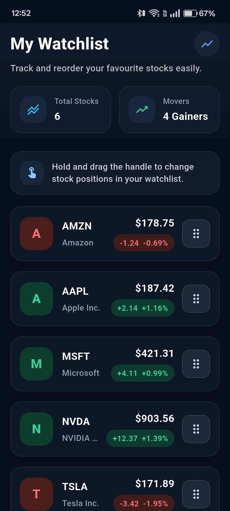
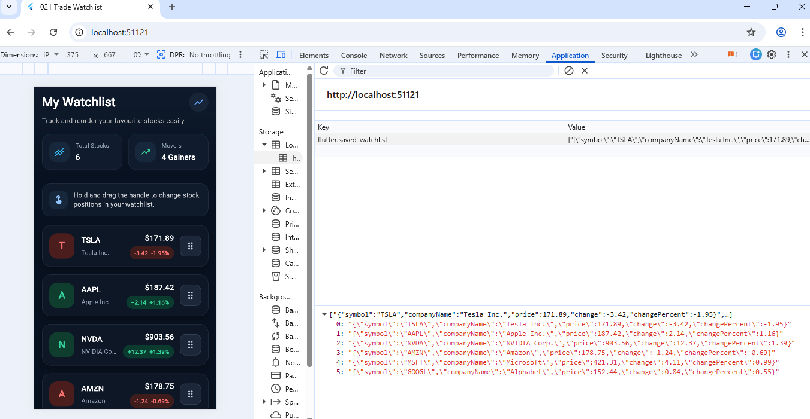

# 📊 Flutter Watchlist Assignment

This project is a Flutter-based stock watchlist application built as part of an assignment.  
The app allows users to view a list of stocks and reorder them using drag-and-drop interactions.

---

## 🎥 App Demo Video

You can watch the working demo of the application here:

👉 [Watch Demo Video](https://drive.google.com/file/d/1UqZ-1zx5R9lsA5tHXh0XvV-DyNk6M_10/view?usp=drivesdk)

---

## 📸 Screenshots

### 🏠 Watchlist Screen

---

### 💾 Persistent Watchlist Order (SharedPreferences)
The reordered watchlist is stored locally using SharedPreferences and restored on app restart.

---

## 🚀 Features

- 📈 Display a list of stocks with price and performance
- 🔄 Drag and drop to reorder watchlist items
- 💾 Persist reordered list using local storage (SharedPreferences)
- 🎨 Clean and modern dark UI
- ⚡ Smooth interaction with press animations
- 🧠 State management using BLoC pattern

---

## 🧱 Tech Stack

- **Flutter**
- **flutter_bloc**
- **equatable**
- **shared_preferences**

---

## 📂 Project Structure

lib/
├── bloc/ # BLoC logic (events, states, bloc)
├── data/ # Repository (data + persistence)
├── models/ # Data models (Stock)
├── screens/ # UI screens
├── widgets/ # Reusable UI components
├── main.dart

---

## 🧠 Architecture

This project follows a simple **BLoC architecture**:

- **Event → Bloc → State → UI**
- UI sends user actions as events
- Bloc processes logic and emits updated state
- UI rebuilds based on new state

### Key Events
- `LoadWatchlist`
- `ReorderWatchlist`

### Key States
- `WatchlistLoading`
- `WatchlistLoaded`
- `WatchlistError`

---

## 🔁 Reorder Logic

- User drags a stock item
- `ReorderWatchlist` event is triggered
- List is updated inside the Bloc
- Updated list is saved locally
- UI refreshes with new order

---

## 💾 Local Persistence

The reordered watchlist is saved using **SharedPreferences**, so the order is preserved even after restarting the app.

---

## 🎨 UI/UX Highlights

- Dark-themed trading-style interface
- Color-coded stock performance (green/red)
- Interactive drag handle
- Press animation for better feedback
- Clean layout with proper spacing and hierarchy

---

